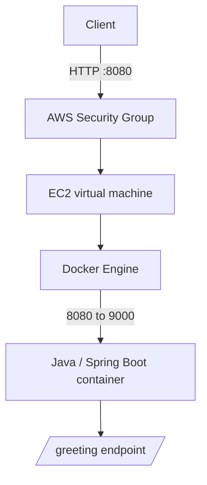
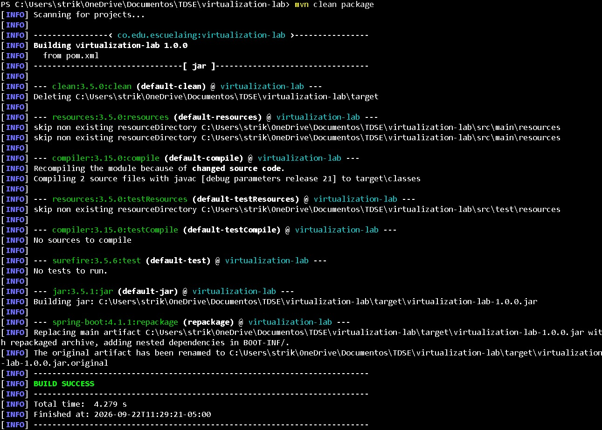

# virtualization-lab

This repository contains the Spring Boot application used in the virtualization, Docker, and AWS EC2 workshop. It is a small web service that is built with Maven, packaged as a Docker image, run locally in isolated containers, and deployed on an EC2 virtual machine.

## Technology

- Java 21
- Maven
- Spring Boot 4.1.1
- Docker and Docker Compose
- Docker Hub
- AWS EC2 on Amazon Linux 2023
- Amazon Corretto 21

## Application

The application is in the `co.edu.escuelaing.virtualizationlab` package.

- `RestServiceApplication` is the Spring Boot entry point. It reads the `PORT` environment variable and sets `server.port` to its value. If `PORT` is not set, it uses `9000`.
- `HelloRestController` exposes `GET /greeting`. The optional `name` query parameter defaults to `World`.

For example:

```text
GET /greeting?name=Pedro
```

returns:

```text
Hello, Pedro!
```

## Build and run locally

Build the project from the repository root:

```bash
mvn clean package
```

This command removes previous build artifacts, compiles the application, runs available tests, and packages the executable JAR. At the time of this documentation, the project has no test sources, so Maven reports that no tests are run.

Run the generated JAR. The application uses port `9000` by default:

```bash
java -jar target/virtualization-lab-1.0.0.jar
```

You can provide a different port through `PORT` before running the command. For PowerShell:

```powershell
$env:PORT=6000
java -jar target/virtualization-lab-1.0.0.jar
```

Then visit `http://localhost:9000/greeting?name=Pedro`, or port `6000` when using the example above.

## Docker

The `Dockerfile` uses `amazoncorretto:21`, sets `/app` as the working directory, copies the Maven-built JAR as `app.jar`, defines `PORT=9000`, exposes port `9000`, and starts the application with `java -jar app.jar`.

Build the image after running `mvn clean package`:

```bash
docker build -t jdrvelasquez/virtualization-lab:1.0 .
```

Run one container, mapping a host port to the internal application port:

```bash
docker run -d --name virtualization-lab-1 -e PORT=9000 -p 34000:9000 jdrvelasquez/virtualization-lab:1.0
```

Verify it at `http://localhost:34000/greeting?name=Container`.

### Container isolation

The same image can run as separate containers on one machine. Each container keeps its own process and network mapping, while the application still listens on internal port `9000`.

```bash
docker run -d --name virtualization-lab-2 -p 34001:9000 jdrvelasquez/virtualization-lab:1.0
docker run -d --name virtualization-lab-3 -p 34002:9000 jdrvelasquez/virtualization-lab:1.0
```

The three mappings used in the workshop were `34000 -> 9000`, `34001 -> 9000`, and `34002 -> 9000`. They can be checked independently through their host ports.

## Docker Compose

`compose.yaml` defines one service named `web`. It builds from the current directory, names the container `virtualization-web`, sets `PORT` to `9000`, and maps host port `8087` to container port `9000`.

Start it with:

```bash
docker compose up -d --build
```

The command builds the image if needed and starts the service in the background. Useful follow-up commands are:

```bash
docker compose ps
docker compose logs web
```

`docker compose ps` shows the state of the Compose service. `docker compose logs web` shows logs for the real service name, `web`. Test the service at `http://localhost:8087/greeting?name=Compose`.

## Docker Hub

The published image repository is [jdrvelasquez/virtualization-lab](https://hub.docker.com/r/jdrvelasquez/virtualization-lab), with these documented tags:

```text
jdrvelasquez/virtualization-lab:1.0
jdrvelasquez/virtualization-lab:latest
```

Docker Hub lets another machine, including the EC2 instance, pull the image without manually transferring the source code.

## AWS EC2 deployment

The application was deployed with the following infrastructure:

| Item | Value |
|---|---|
| Region | `us-east-1` — US East (N. Virginia) |
| Operating system | Amazon Linux 2023 |
| Instance | 1 × `t3.micro` |
| Storage | 8 GiB EBS, volume type **[PENDING CONFIRMATION]** |
| Runtime assumption | 730 hours/month, continuously |
| High availability | No; one EC2 instance |
| Public application port | `8080` |
| Internal container port | `9000` |

The security group allows SSH (`TCP 22`) only from the administrator's IP. The application is publicly accessible through `TCP 8080`. Port `9000` is not opened in the security group because it remains inside the Docker port mapping.

On EC2, the deployed mapping is `8080 -> 9000`. The verified endpoint is:

```text
http://18.234.84.191:8080/greeting?name=AWS
```

The public IP can change if the instance is stopped and recreated, unless an Elastic IP is associated with it.

## Deployment architecture



- The client sends the HTTP request.
- The security group controls inbound traffic to the EC2 instance.
- EC2 provides the virtual compute, memory, storage, and network resources.
- Docker Engine runs the container on the instance.
- The Docker container packages the application and its Java runtime environment.
- The Java web application receives the request at `/greeting` and returns the greeting.

## Cost Analysis

### Real infrastructure data

- Region: `us-east-1`
- Instance: 1 × `t3.micro`
- Storage: 8 GiB EBS
- Operating system: Amazon Linux 2023
- High availability: no

### Analysis assumptions

- Service runtime: 730 hours/month, 24/7
- Average HTTP request size: 1 KB
- Average HTTP response size: 1 KB
- No load balancer, managed database, Auto Scaling, or backup service is included

| Scenario | Monthly requests | Monthly infrastructure cost | Estimated cost per request | Main cost drivers |
|---|---:|---:|---:|---|
| Small workload | 10,000 | [PENDING AWS PRICING CALCULATOR] | [PENDING] | EC2 runtime and EBS storage |
| Medium workload | 100,000 | [PENDING AWS PRICING CALCULATOR] | [PENDING] | EC2 runtime, storage and network transfer |
| Large workload | 1,000,000 | [PENDING AWS PRICING CALCULATOR] | [PENDING] | Instance capacity, storage and network transfer |

| Scenario | Instances | Runtime | EBS | Estimated outbound transfer |
|---|---:|---:|---:|---:|
| Small workload | 1 × `t3.micro` | 730 hours/month | 8 GiB | 0.01 GB/month |
| Medium workload | 1 × `t3.micro` | 730 hours/month | 8 GiB | 0.1 GB/month |
| Large workload | 1 × `t3.micro` | 730 hours/month | 8 GiB | 1 GB/month |

Once values from AWS Pricing Calculator are available, calculate each value as:

```text
Estimated cost per request = monthly infrastructure cost / monthly requests
```

An EC2 deployment has a baseline monthly cost because its compute and storage remain provisioned while the instance is running, even with few requests. That fixed cost becomes less significant per request as the same monthly cost is divided across more requests.

Moving beyond one instance may be necessary when CPU or memory is saturated, concurrency or latency becomes unacceptable, traffic grows, or reliability and availability requirements increase. A production deployment could also require services such as an Application Load Balancer, Auto Scaling, Amazon RDS or another managed database, CloudWatch, backups, Amazon ECR, HTTPS/TLS, and Route 53. These are not part of the current implementation.

For a small workload of 10,000 requests per month, serverless could be more cost-effective if requests are infrequent and there are idle periods, because billing can align more closely with invocation usage. The final decision depends on the actual workload and calculator estimate.

## Evidence

Add the screenshots below to `docs/evidence/`. They are pending and are not included in this repository yet.

### 1. Maven build — [PENDING SCREENSHOT]

Shows the successful `mvn clean package` build.



### 2. Local execution — [PENDING SCREENSHOT]

Shows the application running locally and a successful `/greeting` response.


### 3. Docker image — [PENDING SCREENSHOT]

Shows the built Docker image in `docker images`.


### 4. Three containers — [PENDING SCREENSHOT]

Shows the three isolated local containers and their port mappings.


### 5. Docker Compose — [PENDING SCREENSHOT]

Shows the Compose service running and a successful request on port `8087`.


### 6. Docker Hub — [PENDING SCREENSHOT]

Shows the Docker Hub repository with tags `1.0` and `latest`.


### 7. EC2 instance — [PENDING SCREENSHOT]

Shows the EC2 instance and its relevant configuration.


### 8. Docker on EC2 — [PENDING SCREENSHOT]

Shows `docker ps` on the EC2 instance.


### 9. Public deployment — [PENDING SCREENSHOT]

Shows a successful request to the public EC2 endpoint.


### 10. AWS Pricing Calculator — [PENDING SCREENSHOT]

Shows the calculator estimate used to complete the cost table.


## Project structure

```text
virtualization-lab/
├── src/
│   └── main/java/co/edu/escuelaing/virtualizationlab/
│       ├── HelloRestController.java
│       └── RestServiceApplication.java
├── docs/
│   └── evidence/
├── Dockerfile
├── compose.yaml
├── pom.xml
├── .gitignore
└── README.md
```

## Security notes

- SSH access is restricted to the administrator's IP.
- Port `8080` is the only application port exposed publicly.
- Port `9000` remains internal to the Docker container.
- Private keys such as `*.pem` must never be committed.
- Environment files containing secrets must not be committed.

## Course Framework Extension

**Work in progress.**

The course-framework extension is not included in this repository. It still needs concurrent request handling, graceful shutdown, configuration of the listening port through an environment variable, Docker container execution, and a successful EC2 deployment.
