# virtualization-lab

This repository contains the Spring Boot application used in the virtualization, Docker, and AWS EC2 workshop. It demonstrates how a small Java web service can be built with Maven, packaged as a Docker image, executed in isolated containers, published to Docker Hub, and deployed on an Amazon EC2 virtual machine.

## Technology

- Java 21
- Maven
- Spring Boot 4.1.1
- Docker and Docker Compose
- Docker Hub
- AWS EC2 on Amazon Linux 2023
- Amazon Corretto 21

## Application

The application is in the `co.edu.escuelaing.virtualizationlab` package.

- `RestServiceApplication` is the Spring Boot entry point. It reads the `PORT` environment variable and uses it as the HTTP listening port. If `PORT` is not defined, the current project configuration uses port `9000`.
- `HelloRestController` exposes `GET /greeting`. The optional `name` query parameter defaults to `World`.

Example:

```text
GET /greeting?name=Pedro
```

Response:

```text
Hello, Pedro!
```

## Build and run locally

Build the application from the repository root:

```bash
mvn clean package
```

This command removes previous build artifacts, compiles the application, runs the available tests, and packages the application as an executable JAR.

Run the generated JAR:

```bash
java -jar target/virtualization-lab-1.0.0.jar
```

To define the port in PowerShell:

```powershell
$env:PORT="9000"
java -jar target/virtualization-lab-1.0.0.jar
```

Then test:

```text
http://localhost:9000/greeting?name=Pedro
```

The application can also be run directly with Maven:

```bash
mvn spring-boot:run
```

## Docker

The `Dockerfile` uses Amazon Corretto 21 as the Java runtime, sets `/app` as the working directory, copies the Maven-built JAR as `app.jar`, defines the application port, exposes that port, and starts the application with `java -jar app.jar`.

Build the image after running `mvn clean package`:

```bash
docker build -t jdrvelasquez/virtualization-lab:1.0 .
```

Run one container:

```bash
docker run -d --name virtualization-lab-1 -e PORT=9000 -p 34000:9000 jdrvelasquez/virtualization-lab:1.0
```

Verify it at:

```text
http://localhost:34000/greeting?name=Container
```

### Container isolation

The same image was executed as multiple isolated containers on the same host. Each container runs its own process and network namespace while the application continues listening on the same internal port, `9000`.

```bash
docker run -d --name virtualization-lab-2 -e PORT=9000 -p 34001:9000 jdrvelasquez/virtualization-lab:1.0
docker run -d --name virtualization-lab-3 -e PORT=9000 -p 34002:9000 jdrvelasquez/virtualization-lab:1.0
```

The mappings used were:

```text
Host 34000 -> Container 9000
Host 34001 -> Container 9000
Host 34002 -> Container 9000
```

This demonstrates container isolation: the three containers can use the same internal application port without conflicting because each container has an isolated network environment. Only the host-side ports must be different.

## Docker Compose

`compose.yaml` defines one service named `web`. It builds the image from the current directory, creates the `virtualization-web` container, sets `PORT=9000`, and maps host port `8087` to container port `9000`.

Start the service with:

```bash
docker compose up -d --build
```

Useful commands:

```bash
docker compose ps
docker compose logs web
```

Test the Compose deployment at:

```text
http://localhost:8087/greeting?name=Compose
```

## Docker Hub

Published repository:

```text
jdrvelasquez/virtualization-lab
```

Published tags:

```text
jdrvelasquez/virtualization-lab:1.0
jdrvelasquez/virtualization-lab:latest
```

Docker Hub allows another machine, such as an EC2 instance, to download the already-built application image without transferring the source code manually.

## AWS EC2 deployment

The application was deployed successfully with the following infrastructure:

| Item | Value |
|---|---|
| Region | `us-east-1` — US East (N. Virginia) |
| Operating system | Amazon Linux 2023 |
| Instance | 1 × `t3.micro` |
| Storage | 8 GiB EBS |
| Cost-model EBS type | General Purpose SSD (`gp3`) |
| Runtime assumption | 730 hours/month, continuously |
| High availability | No; only one EC2 instance |
| Public application port | `8080` |
| Internal container port | `9000` |

The Security Group allows SSH (`TCP 22`) only from the administrator's IP. The application is publicly accessible through `TCP 8080`. Port `9000` is not exposed directly in the Security Group because it remains the internal Docker application port.

The EC2 Docker mapping is:

```text
EC2 :8080 -> Docker container :9000
```

The deployment was verified through:

```text
http://18.234.84.191:8080/greeting?name=AWS
```

> The public IPv4 address can change if the instance is stopped and started again unless a static address is configured.

### EC2 deployment commands

After Docker was installed and the `ec2-user` was added to the Docker group, the image was downloaded from Docker Hub:

```bash
docker pull jdrvelasquez/virtualization-lab:1.0
```

The application container was started with:

```bash
docker run -d \
  --name virtualization-lab \
  --restart unless-stopped \
  -e PORT=9000 \
  -p 8080:9000 \
  jdrvelasquez/virtualization-lab:1.0
```

Verification commands:

```bash
docker ps
docker logs virtualization-lab
```

## Deployment architecture

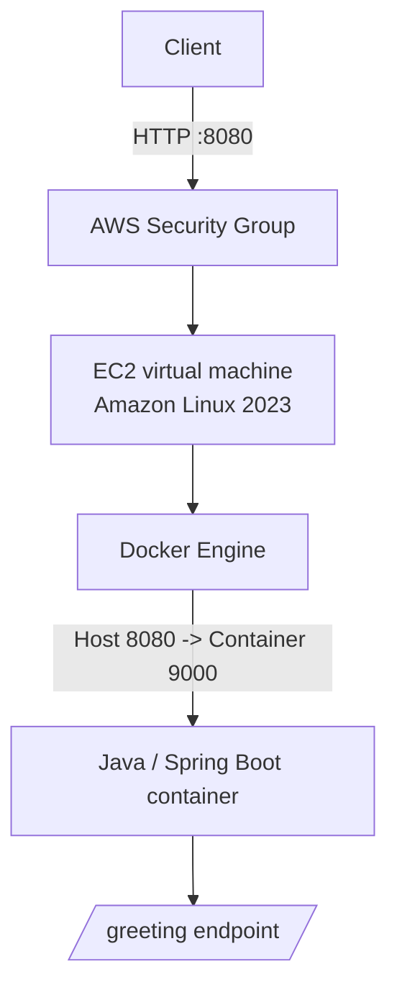

Responsibilities:

- **Client:** sends the HTTP request.
- **Security Group:** controls which inbound network connections can reach EC2.
- **EC2 virtual machine:** provides rented compute, memory, storage, and networking resources.
- **Docker Engine:** creates and manages containers on the EC2 host.
- **Docker container:** packages the application and Java runtime in a portable execution environment.
- **Java web application:** receives the request and returns the greeting response.

# Cost Analysis

## Real infrastructure data

- Region: `us-east-1` — US East (N. Virginia)
- Instance: 1 × `t3.micro`
- Storage: 8 GiB EBS
- Operating system: Amazon Linux 2023
- High availability: no
- Application exposed through one public IPv4 address

## Analysis assumptions

To keep the comparison simple, all three workloads use the same infrastructure. The workload only changes the number of HTTP requests and the theoretical amount of outbound data.

- Service runtime: 730 hours/month (24/7)
- Average HTTP request size: 1 KB
- Average HTTP response size: 1 KB
- No load balancer
- No managed database
- No Auto Scaling
- No additional backup service
- No second EC2 instance for high availability
- EBS type used in the calculator: `gp3`

### Workload assumptions

| Scenario | Monthly requests | Instances | Runtime | EBS | Theoretical outbound transfer |
|---|---:|---:|---:|---:|---:|
| Small workload | 10,000 | 1 × `t3.micro` | 730 h/month | 8 GiB | ~0.01 GB/month |
| Medium workload | 100,000 | 1 × `t3.micro` | 730 h/month | 8 GiB | ~0.1 GB/month |
| Large workload | 1,000,000 | 1 × `t3.micro` | 730 h/month | 8 GiB | ~1 GB/month |

The theoretical transfer values come from the simplified assumption of approximately 1 KB returned per request. They are workload assumptions, not measurements from production traffic.

## AWS Pricing Calculator result

The AWS Pricing Calculator configuration used:

- US East (N. Virginia)
- Linux
- Shared tenancy
- Constant usage
- 1 × `t3.micro`
- On-Demand
- 100% monthly utilization
- 8 GB `gp3` EBS
- No snapshots
- No detailed monitoring
- Small network-transfer volume

The calculator returned:

```text
Estimated monthly cost: USD 8.23
Estimated 12-month cost: USD 98.76
Upfront cost: USD 0.00
```

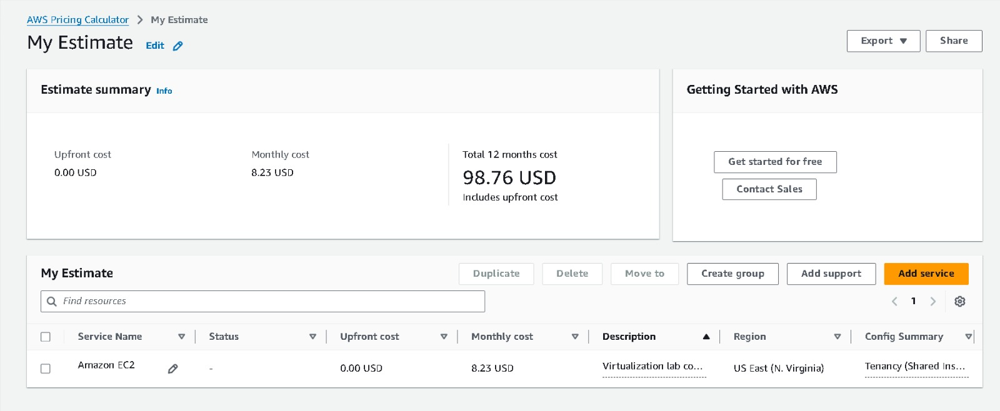

### Why do the three workloads have the same calculator cost?

The Small, Medium, and Large scenarios intentionally keep the provisioned infrastructure unchanged: one `t3.micro`, the same 8 GiB EBS volume, and 730 hours of runtime each month. EC2 is therefore a mostly fixed monthly cost in this design.

The expected traffic is also extremely small compared with the continuously provisioned compute capacity. The theoretical outbound values are approximately 0.01 GB, 0.1 GB, and 1 GB per month. In the calculator interface used for this workshop, transfer input was handled at whole-GB granularity, so the low-volume scenarios do not create a meaningful difference in the estimate. Consequently, the EC2 runtime and EBS storage dominate the calculation and the three scenarios remain approximately **USD 8.23/month**.

This is not a claim that one `t3.micro` is guaranteed to handle every possible pattern of one million requests. The request counts are monthly totals. Real capacity depends on request complexity, concurrency, traffic peaks, CPU use, memory use, and latency requirements. A load test would be required to prove capacity under peak conditions.

## Calculator-based cost per request

Formula:

```text
Estimated cost per request = monthly infrastructure cost / monthly requests
```

Using the calculator result of USD 8.23/month:

| Scenario | Monthly requests | Monthly infrastructure cost | Estimated cost per request | Main cost drivers |
|---|---:|---:|---:|---|
| Small workload | 10,000 | USD 8.23 | USD 0.000823 | EC2 runtime and EBS storage |
| Medium workload | 100,000 | USD 8.23 | USD 0.0000823 | EC2 runtime and EBS storage |
| Large workload | 1,000,000 | USD 8.23 | USD 0.00000823 | EC2 runtime and EBS storage; capacity should be validated under load |

The important result is that the **monthly infrastructure cost stays nearly fixed while the cost per request falls as more requests share the same provisioned infrastructure**.

## Independent manual cost estimate

As a second estimate, independent from the calculator summary, the infrastructure can be reconstructed manually. This estimate is intentionally conservative and assumes that no Free Tier credits or promotional credits apply.

### Base infrastructure

| Component | Assumption | Estimated monthly cost |
|---|---|---:|
| EC2 compute | `t3.micro`, 730 h/month | ~USD 7.59 |
| EBS storage | 8 GiB `gp3` | ~USD 0.64 |
| Public IPv4 | 1 public IPv4 × 730 h/month × USD 0.005/h | ~USD 3.65 |
| Data transfer | ≤ 1 GB/month in these scenarios | Treated as USD 0 in this base estimate |
| **Independent total** | Before taxes and optional services | **~USD 11.88/month** |

The difference between **USD 8.23** from the calculator and **USD 11.88** in this conservative manual estimate is the explicit inclusion of the public IPv4 address. Whether that IPv4 produces an actual charge can depend on the account's Free Tier eligibility and credits, so the AWS bill can differ from this manual scenario.

Using the conservative manual total of USD 11.88/month:

| Scenario | Monthly requests | Independent monthly estimate | Estimated cost per request |
|---|---:|---:|---:|
| Small workload | 10,000 | USD 11.88 | USD 0.001188 |
| Medium workload | 100,000 | USD 11.88 | USD 0.0001188 |
| Large workload | 1,000,000 | USD 11.88 | USD 0.00001188 |

This manual estimate is a **cost-model scenario**, not a replacement for the AWS Pricing Calculator or the final AWS bill. It is useful for showing which infrastructure components are fixed and which can vary.

### Pricing references for the manual estimate

- AWS EC2 On-Demand pricing: https://aws.amazon.com/ec2/pricing/on-demand/
- AWS guidance showing `t3.micro` On-Demand pricing for `us-east-1`: https://docs.aws.amazon.com/prescriptive-guidance/latest/optimize-costs-microsoft-workloads/right-size-selection.html
- AWS EBS `gp3` pricing reference: https://docs.aws.amazon.com/emr/latest/ManagementGuide/emr-plan-storage-compare-volume-types.html
- AWS VPC public IPv4 pricing: https://aws.amazon.com/vpc/pricing/

## Architectural discussion

### 1. Why does an EC2 deployment have a baseline monthly cost even with few requests?

The EC2 instance and EBS storage remain provisioned while the service is running. The infrastructure therefore incurs cost even when the application is idle. Unlike a purely request-based execution model, the virtual machine is allocated continuously.

### 2. At which workload level does the fixed cost become less significant per request?

It becomes progressively less significant as monthly request volume increases. With the same USD 8.23 calculator cost, the estimated cost per request falls from `0.000823` USD at 10,000 requests to `0.00000823` USD at 1,000,000 requests.

### 3. What could force the deployment to use multiple EC2 instances?

A second or additional instance could become necessary when CPU or memory becomes saturated, concurrency increases, response latency becomes unacceptable, traffic peaks exceed the capacity of one instance, or the system requires higher availability. Request count alone is not sufficient to make this decision; measurements and load testing are required.

### 4. What additional services could a production deployment require?

A production architecture could add an Application Load Balancer, Auto Scaling, a managed database such as Amazon RDS, CloudWatch monitoring, backups, Amazon ECR, HTTPS/TLS certificates, DNS through Route 53, and multiple instances across Availability Zones. These services are not part of the current workshop implementation.

### 5. Could serverless be more cost-effective for the small workload?

Potentially. The Small scenario contains only 10,000 requests per month while the EC2 instance is assumed to run continuously for 730 hours. A serverless design can align more of the cost with actual invocations and idle time. However, the final comparison would depend on execution duration, memory allocation, request patterns, cold-start requirements, and any additional managed services used by the serverless architecture.

## Evidence

The following screenshots are stored under `docs/evidence/`.

### 1. Maven build

Shows a successful `mvn clean package` build.


### 2. Local execution

Shows the application running locally and a successful `/greeting` response.

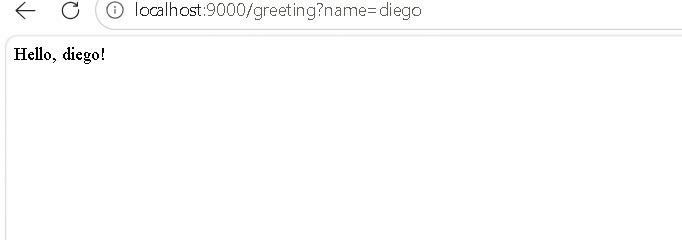

### 3. Docker image

Shows `jdrvelasquez/virtualization-lab:1.0` in `docker images`.

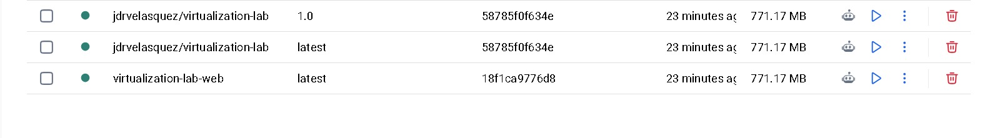

### 4. Three isolated containers — [PENDING SCREENSHOT]

Shows the three containers with host ports `34000`, `34001`, and `34002` mapped to internal port `9000`.

No uploaded screenshot shows the three containers running at the same time yet.

### 5. Docker Compose

The first screenshot shows both `docker compose up -d --build` and `docker compose ps`. The second shows the resulting container through the general `docker ps` command, and the third confirms the service response on port `8087`.

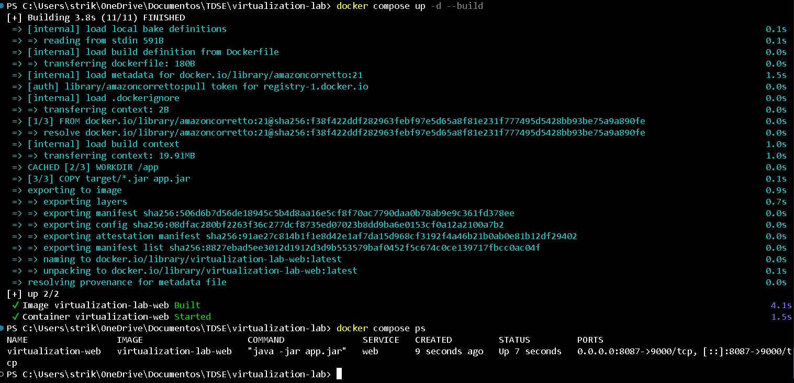

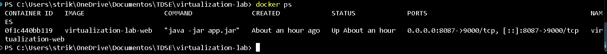

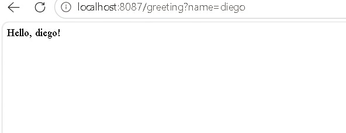

### 6. Docker Hub

Shows the Docker Hub repository with tags `1.0` and `latest`.

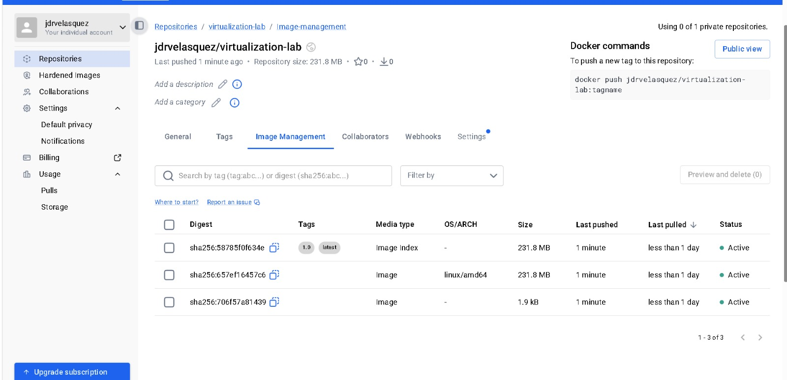

### 7. EC2 instance

Shows the `virtualization-lab` EC2 instance in the `Running` state and its relevant configuration.

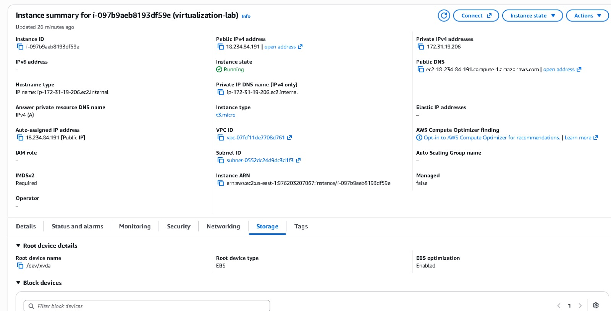

### 8. Docker on EC2

Shows `docker ps` on the EC2 instance with the deployed container running.

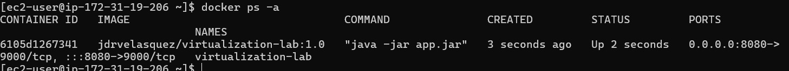

### 9. Public deployment

Shows the successful request to the public EC2 endpoint on port `8080`.

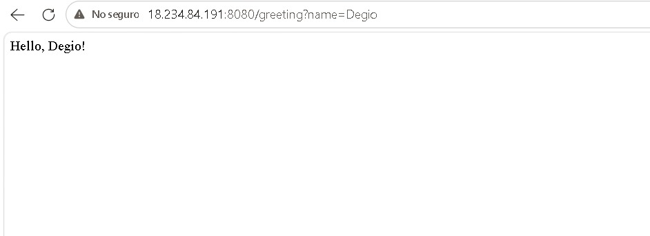

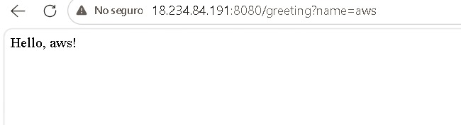

### 10. AWS Pricing Calculator — INCLUDED

Shows the estimate used for the cost analysis.


## Project structure

```text
virtualization-lab/
├── src/
│   └── main/java/co/edu/escuelaing/virtualizationlab/
│       ├── HelloRestController.java
│       └── RestServiceApplication.java
├── docs/
│   └── evidence/
│       └── 10-aws-pricing-calculator.png
├── Dockerfile
├── compose.yaml
├── pom.xml
├── .gitignore
└── README.md
```

## Security notes

- SSH access is restricted to the administrator's IP.
- Port `8080` is the only application port exposed publicly.
- Port `9000` remains internal to the Docker container.
- Private keys such as `*.pem` must never be committed.
- `.env` files containing secrets must not be committed.
- The EC2 private key should preferably be stored outside the repository, for example under the user's `.ssh` directory.

## Course Framework Extension

**Work in progress.**

The workshop also requires deploying the course's own web framework instead of Spring. This extension still needs to be completed and verified with:

- concurrent request handling;
- graceful shutdown;
- listening port configured through an environment variable;
- Docker container execution;
- successful EC2 deployment.

The concurrency change should be implemented in the server component that accepts client connections so that request processing does not block the accept loop. This extension must be documented separately once it is implemented and tested.
